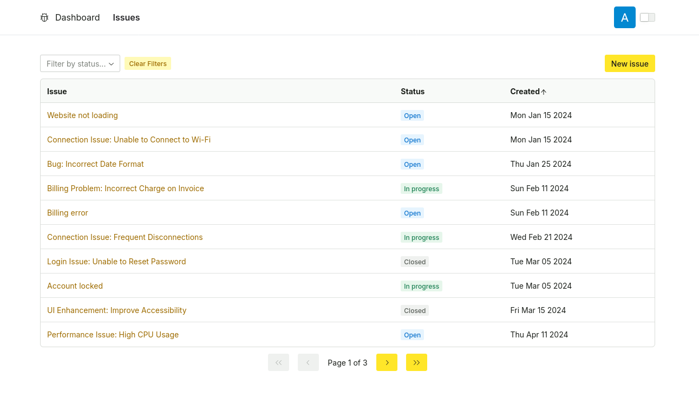
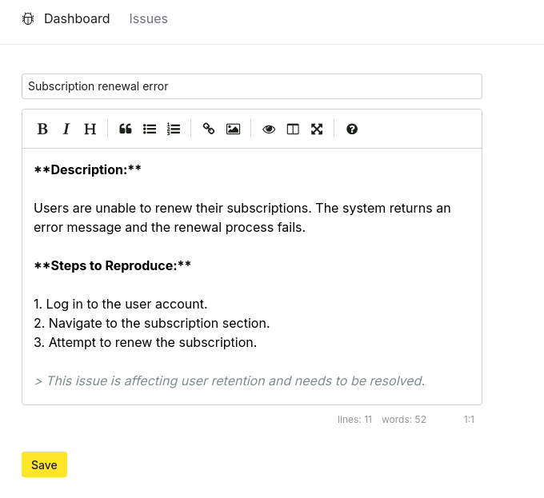
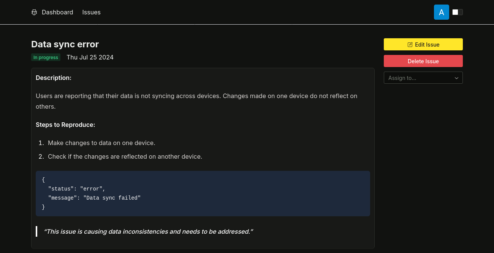

# Issue Tracker

A fullstack application used to track and manage different tickets: Feature requests, issues or bugs

## Feautures

- View, edit, create and delete issues.
- Assign tickets to different users
- Sorting and filtering
- Pagination
- Google login and authentication

## MarkDown Editor

### Dark mode

## Tech Stack

Project deployed on vercel with backend database hosted on digitalOcean

### Frontend

- Next.js |  React | Typescript
- Tailwindcss | RadixUI Themes
- React Query | Axios
- React Hook Form
- Recharts

### Backend

- MySQL | Prisma
- NextAuth
